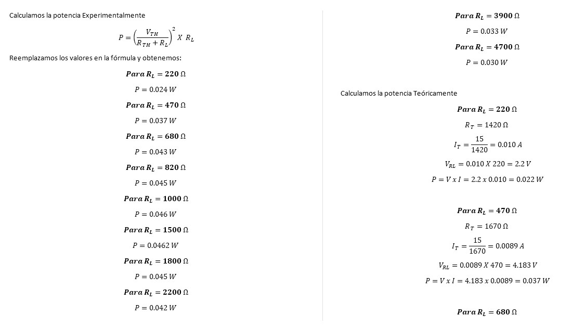

InformeLaboratorioNo6
==========================
# PRÁCTICA No. 6 TEOREMA DE LA MAXIMA TRANSFERENCIA DE POTENCIA
1. OBJETIVOS
* 1.1 OBJETIVO GENERAL

Implementar el conocimiento de superposición tanto teóricamente y prácticamente con el uso de herramientas que le permitan diseñar circuitos de una forma digital con lo cual se analizara tanto los resultados calculados como simulados 

* 1.2 OBJETIVOS ESPECIFICOS
  * Analizar circuitos mediante superposición
  * diseñar circuitos de tal manera que se facilita su resolución 
  * similar circuitos mediante una herramienta digital 
  * Comparar resultados simulados y calculados 

2. REQUISITOS PREVIOS

Se requiere el análisis analítico del circuito mostrado en la figura 4.1., aplicando el Teorema de Superposición. Obtenga los valores de VA e IX, respetando tanto la   polaridad del voltaje como el sentido de la corriente que se proporcionan y anote los resultados en la tabla 4.1. y 4.2. según corresponda.

3. INFORMACION GENERAL 

Los simuladores de circuitos electrónicos son muy útiles para explicar el comportamiento de éstos de una forma asequible a los alumnos de la rama de Eléctrica y Electrónica. El uso de la simulación por ordenador es una herramienta imprescindible hoy en día a la hora de explicar la electrónica en el aula, al ser la forma más sencilla y rápida de comprobar el funcionamiento de un circuito. Además, no necesita ningún tipo de material adicional para el montaje del mismo o medida de los resultados.

4. MATERIAL Y EQUIPO REQUERIDO

| Cantidad | Elemento | 
| --------- | --------- | 
| 1 | Fuente de Voltaje de C.D. | 
| 1 | Multímetros Digitales | 
| 1 | Resistor de 220 Ω |
| 1 | Resistor de 470 Ω | 
| 1 | Resistor de 680 Ω |
| 1 | Resistor de 820 Ω |
| 1 | Resistor de 1 kΩ | 
| 1 | Resistor de 1.5 KΩ |
| 1 | Resistor de 1.8 KΩ |
| 1 | Resistor de 2.2 kΩ |
| 1 | Resistor de 3.9 kΩ |
| 1 | Resistor de 4.7 kΩ |
| 1 | Protoboard |

5. PROCEDIMIENTO

### 5.1 Arme el circuito que se presenta en la figura 6.1.

 

### 6.2 Mida el voltaje y la corriente para cada valor de RL que se indica en la tabla 6.1. Anote los resultados medidos.

### 6.3 Calcule las potencia consumida por RL, para cada valor dado y anote los resultados en la tabla 6.1.

 
 
 
  
   
### 6.4 ¿Se cumple el Teorema de la Máxima Transferencia de Potencia? Argumente su respuesta.

No se cumple el teorema ya que ninguna resistencia RL tenia el valor igual a la resistencia de la fuente

### 6.5 ¿Cuál fue la potencia máxima en RL?   0.046     Watts

### 6.6 ¿Para qué valor de RL se obtiene la MTP?  1000    Ω

### Tabla 6.1. Parámetros Eléctricos del circuito de la figura 6.1.

6. VIDEO

https://youtu.be/XwZlPMQG2Ew

7. CONCLUSIONES

 - Se pudo comprobar que los valores obtenidos de los voltajes como de las corrientes fueron muy semejantes a los obtenidos mediante verificar el circuito analiticamente, con unos pequeños margenes de error.
Asi mismo tanto para las tablas obtenidas, se comprobó el uso del teorema de superposición, mediante las ecuaciones encontradas, los cálculos obtenidos nos asemejan a una silmulación real, todo este proceso de usar la ley antes mencionadas nos permiten a que los valores sean precisos y casi exactos, apoyandonos del mismo ciruito para usar las fórmulas como la dirección de los voltajes y corrientes.

8. BIBLIOGRAFIA

 Floyd Thomas L, “Principios de Circuitos Eléctricos”, 8 ed. 2007 .Pearson Educación de México, S.A. de C.V. México, pp. 281-333.
